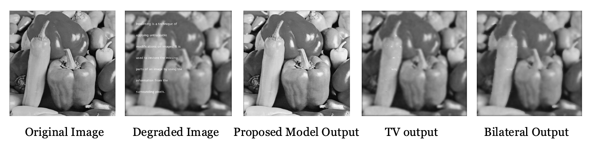
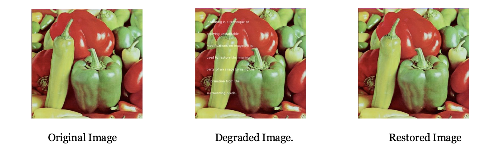
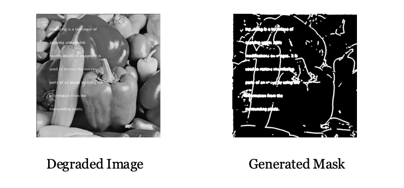

# Fractional-Order Image Inpainting

## Reproduction and Extension of an Image Inpainting Model Based on Fractional-Order Nonlinear Diffusion

This repository presents the reproduction and extension of the paper:

> **Image Inpainting Based on Fractional-Order Nonlinear Diffusion for Image Reconstruction**
> G. Sridevi and S. Srinivas Kumar, 2019

The work investigates the use of fractional-order nonlinear diffusion and difference-curvature-driven conductance functions for image restoration, inpainting, denoising, and deblurring.

Beyond reproducing the original methodology, this work introduces several extensions including RGB image processing through 3D signal modeling, automatic edge-driven mask generation, and comparative evaluation against classical image restoration approaches.

---

# Research Contributions

## Reproduction Study

* Reproduced the original fractional-order nonlinear diffusion framework for image inpainting.
* Implemented fractional-order derivatives using Fourier-domain formulations.
* Recreated the difference-curvature-based adaptive conductance mechanism.
* Evaluated reconstruction performance on benchmark images.

## Extension 1: RGB Image Inpainting

The original work was designed for grayscale images.

This project extends the methodology to RGB images using:

* Channel-wise reconstruction
* Direct 3D signal processing formulation

The direct 3D approach incorporates inter-channel dependencies and preserves color consistency during restoration.

## Extension 2: Edge-Driven Automatic Mask Generation

The original paper assumes that inpainting masks are already available.

To improve practical usability, an automatic mask generation pipeline was developed using:

* Sobel edge detection
* Morphological dilation
* Binary mask construction

This enables restoration directly from degraded images without manually supplied masks.

## Extension 3: Comparative Evaluation

The proposed method was compared against:

* Total Variation (TV) Reconstruction
* Bilateral Telea Inpainting

using:

* Peak Signal-to-Noise Ratio (PSNR)
* Mean Structural Similarity Index (MSSIM)
* Figure of Merit (FoM)

---

# Methodology

The proposed framework combines:

1. Fractional-order derivatives implemented using the Discrete Fourier Transform (DFT)
2. Difference Curvature (DC) based edge detection
3. Adaptive conductance coefficients
4. Fractional-order nonlinear diffusion
5. Variational restoration for non-inpainting regions

The model aims to preserve edges while minimizing staircase artifacts and speckle noise commonly observed in traditional diffusion approaches.

---

# Key Results

## Average Performance Across Benchmark Images

| Model             | PSNR  | MSSIM  | FoM    |
| ----------------- | ----- | ------ | ------ |
| Proposed Method   | 34.80 | 0.9765 | 0.9529 |
| TV Reconstruction | 25.21 | 0.8989 | 0.5661 |
| Bilateral Telea   | 24.63 | 0.7617 | 0.3243 |

The fractional-order diffusion model consistently demonstrated superior structural preservation, edge reconstruction, and artifact suppression.

## RGB Extension Results

| Method                      | PSNR  | MSSIM  | FoM    |
| --------------------------- | ----- | ------ | ------ |
| Direct 3D Signal Processing | 49.78 | 0.9953 | 0.9376 |
| Channel Separation          | 27.42 | 0.9915 | 0.9394 |

The direct 3D formulation achieved substantially higher reconstruction quality while maintaining color consistency across channels.

---

# Sample Results

## Image Restoration Comparison



## RGB Extension



## Edge-Driven Mask Generation



---

# Applications

Potential applications include:

* Image restoration
* Object removal
* Historical photograph reconstruction
* Medical image enhancement
* Satellite image restoration
* Computer vision preprocessing

---

# Repository Structure

```text
fractional-order-image-inpainting/

├── README.md
├── docs/
│   ├── Project_Report.pdf
│   ├── Project_Presentation.pdf
│   └── Project_Presentation.pptx
│
├── images/
│   ├── restoration_comparison.png
│   ├── rgb_extension.png
│   └── edge_mask_generation.png
│
└── src/
```

---

# Research Artifacts

* [Research Report](docs/Project_Report.pdf)
* [Presentation Slides](docs/Project_Presentation.pdf)

---

# Future Work

Potential future directions include:

* Deep-learning-assisted image inpainting
* Hybrid PDE-CNN restoration frameworks
* Hyperspectral image restoration
* Adaptive parameter optimization
* Large-scale image benchmark evaluation

---

# Authors

**Jay Nidumolu**
University of Waterloo

**Praveen Raavi**
University of Waterloo

---

# Citation

If you find this work useful, please cite the original paper and this repository.

---

# Acknowledgements

This work reproduces and extends the methodology proposed in:

G. Sridevi and S. Srinivas Kumar, *Image Inpainting Based on Fractional-Order Nonlinear Diffusion for Image Reconstruction*, Circuits, Systems, and Signal Processing, 2019.
